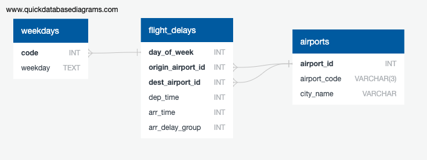

# Flight Prediction Analysis

## Overview
I am building a predtion model using data from California incoming and outgoing flights othroughout the past year.  The goal is to be able to predict whether a flight will be delayed and how long.  This data comes from the Buraeu of Transportation Statistiucs website and allows a user to download a csv with a selection of columns to choose from.  The columns I chose to use as part of my analysis will be shown in the schema below.

## Database
The schema for the database I built the follwing tables.

 
  

The weekdays and airports  tables are used to map user input in the app.

## Model

Using the database above, I grouped delay times based on well distributed chunks to ensure unskewed testing.  0 is a flight arriving early, 1 is on time or withing 15 minutes, and 2 is over 30 because that can be a proble.  I also grouped the departure and arival time because of skewed distrubution. The dataset is about 800,000 rows and for this reason I have chosen to use the Random Forest model because there are many classifiers so the extra branches will be helpful and protect against over sampling.  Also, since the dataset is so large, the Random Forest Classifier will manage the large dataset better then the others.

[Field Distribution Analysis Dashboard](https://public.tableau.com/app/profile/ellen4214/viz/DataDistributionforFlightPrediction/DIstributionforFlightPrediction?publish=yes)

[Presentation Slides](https://docs.google.com/presentation/d/10mfS_be6skfyssHYx63iPjoK6fNltrroy_06Q5Z2Ygs/edit#slide=id.g10363563cba_0_208)
